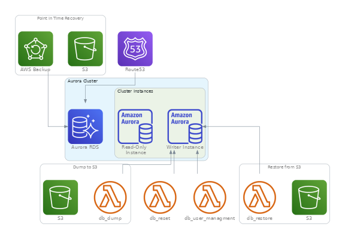

# Documentation

## Introducción

El Wrapper de Terraform para RDS Aurora simplifica la configuración del Servicio de Base de Datos Relacional en la nube de AWS. Este wrapper funciona como una plantilla predefinida, facilitando la creación y gestión de instancias de RDS Aurora al encargarse de todos los detalles técnicos.
[Documentación Módulo Externo RDS Aurora](https://registry.terraform.io/modules/terraform-aws-modules/rds-aurora/aws/9.14.0)

**Features**
- [Administración de Usuarios y Bases](#administración-de-usuarios-y-bases)
- [Dump con S3](#dump-con-s3)
- [Restore con S3](#restore-con-s3)
- [DB Reset](#db-reset)
- [Registro DNS](#registro-dns)
- [Enrolamiento de Point in time Recovery](#enrolamiento-de-point-in-time-recovery)

**Diagrama** <br/>
A continuación se puede ver una imagen que muestra la totalidad de recursos que se pueden desplegar con el wrapper:

<center></center>

---

## Modo de Uso

```hcl
rds_aurora_parameters = {
  "mysql-00" = {
    deletion_protection = false
    apply_immediately   = true
    skip_final_snapshot = true

    # subnets  = data.aws_subnets.public.ids # Default: ""
    # subnet_name = "${local.common_name_prefix}-public*" # Default: "${local.common_name_prefix}-private*"

    engine                 = "aurora-mysql"
    engine_version         = "8.0"
    parameter_group_family = "aurora-mysql8.0"

    # Instances
    instances = {
      1 = {
        # identifier     = "master-member-1" # Optional custom instance name
        instance_class = "db.t3.medium"
      }
    }

    dns_records = {
      "" = {
        zone_name    = local.zone_private
        private_zone = true
      }
    }

    # Parameter group
    db_cluster_parameter_group_parameters = [
      {
        name         = "connect_timeout"
        value        = 120
        apply_method = "immediate"
      },
      {
        name         = "innodb_lock_wait_timeout"
        value        = 300
        apply_method = "immediate"
      }
    ]
    db_parameter_group_parameters = [
      {
        name         = "connect_timeout"
        value        = 60
        apply_method = "immediate"
      },
      {
        name         = "general_log"
        value        = 0
        apply_method = "immediate"
      }
    ]

    # Monitoring & logs
    enabled_cloudwatch_logs_exports = ["error", "slowquery"]
  }

  "postgresql-00" = {
    deletion_protection = false
    apply_immediately   = true
    skip_final_snapshot = true

    engine                 = "aurora-postgresql"
    engine_version         = "16.2"
    parameter_group_family = "aurora-postgresql16"

    port = "5432"

    # Instances
    instances = {
      1 = {
        instance_class = "db.t3.medium"
      }
    }

    dns_records = {
      "" = {
        zone_name    = local.zone_private
        private_zone = true
      }
    }

    # Parameter group
    db_cluster_parameter_group_parameters = [
      {
        name         = "log_min_duration_statement"
        value        = 4000
        apply_method = "immediate"
      },
      #{
      #  name         = "rds.force_ssl"
      #  value        = 0
      #  apply_method = "immediate"
      #}
    ]
    db_parameter_group_parameters = [
      {
        name         = "log_min_duration_statement"
        value        = 4000
        apply_method = "immediate"
      }
    ]

    # Monitoring & logs
    enabled_cloudwatch_logs_exports = ["postgresql"] # Default = []
  }
}
```

<details>
<summary>Tabla de Variables</summary>

| Variable                | Descripción                                  | Tipo   | Valor por Defecto                                        | Alternativa Genérica              |
|-------------------------|----------------------------------------------|--------|---------------------------------------------------------|-----------------------------------|
| `name`                  | Nombre del clúster Aurora RDS                | string | `"${local.common_name}-${each.key}"`                      | custom name                      |
| `create_db_subnet_group` | Indica si debe crear el grupo de subredes    | bool   | true                                                     | false                            |
| `db_subnet_group_name`   | Nombre del grupo de subredes para el clúster | string | `"${local.common_name}-${each.key}-sg"`                    | custom name                      |
| `subnets`               | Subnets asociadas al grupo de subredes       | list   | `data.aws_subnets.this[each.key].ids`                      | custom list of subnet IDs        |
| `cluster_use_name_prefix`                  | Indica si usar un prefijo para el nombre del clúster           | bool    | false                                                           | true                              |
| `is_primary_cluster`                       | Define si el clúster es primario                               | bool    | true                                                            | false                             |
| `allocated_storage`                        | Cantidad de almacenamiento asignado                            | number  | null                                                            | custom number                     |
| `allow_major_version_upgrade`              | Permite actualizaciones mayores de versión                     | bool    | false                                                           | true                              |
| `apply_immediately`                        | Aplica cambios de forma inmediata                              | bool    | false                                                           | true                              |
| `availability_zones`                       | Zonas de disponibilidad asociadas                              | list    | null                                                            | custom list                       |
| `backup_retention_period`                  | Período de retención de backups                                | number  | null                                                            | custom number                     |
| `backtrack_window`                         | Ventana de retroceso                                           | number  | null                                                            | custom number                     |
| `cluster_members`                          | Miembros del clúster                                           | list    | null                                                            | custom list                       |
| `copy_tags_to_snapshot`                    | Copia etiquetas al snapshot                                    | bool    | null                                                            | true                              |
| `database_name`                            | Nombre de la base de datos                                     | string  | null                                                            | custom name                       |
| `db_cluster_instance_class`                | Clase de la instancia del clúster                              | string  | null                                                            | custom instance class             |
| `db_cluster_db_instance_parameter_group_name`| Nombre del grupo de parámetros de instancia del clúster         | string  | ""                                                              | custom name                       |
| `delete_automated_backups`                 | Elimina backups automáticos                                    | bool    | null                                                            | true                              |
| `deletion_protection`                      | Protección contra eliminación                                  | bool    | true                                                            | false                             |
| `enable_global_write_forwarding`           | Habilita la escritura global directa                           | bool    | null                                                            | true                              |
| `enabled_cloudwatch_logs_exports`          | Tipos de logs exportados a CloudWatch                          | list    | []                                                              | custom list of logs               |
| `enable_http_endpoint`                     | Habilita el endpoint HTTP                                      | bool    | null                                                            | true                              |
| `engine`                                   | Motor de la base de datos                                      | string  | null                                                            | custom engine                     |
| `engine_mode`                              | Modo del motor de la base de datos                             | string  | "provisioned"                                                    | custom engine mode                |
| `engine_version`                           | Versión del motor                                              | string  | null                                                            | custom version                    |
| `final_snapshot_identifier`                | Identificador del snapshot final                               | string  | null                                                            | custom snapshot ID                |
| `global_cluster_identifier`                | Identificador del clúster global                               | string  | null                                                            | custom cluster ID                 |
| `iam_database_authentication_enabled`      | Habilita la autenticación de base de datos mediante IAM         | bool    | false                                                           | true                              |
| `iops`                                     | IOPS asignados                                                 | number  | null                                                            | custom iops                       |
| `kms_key_id`                               | Identificador de la clave KMS                                  | string  | null                                                            | custom KMS key                    |
| `network_type`                             | Tipo de red (IPV4 o DUAL)                                      | string  | null                                                            | custom network type               |
| `port`                                     | Puerto de la base de datos                                     | number  | 3306                                                            | custom port                       |
| `preferred_backup_window`                  | Ventana de backup preferida                                    | string  | "02:00-03:00"                                                    | custom backup window              |
| `preferred_maintenance_window`             | Ventana de mantenimiento preferida                             | string  | "sun:05:00-sun:06:00"                                            | custom maintenance window         |
| `replication_source_identifier`            | Identificador de la fuente de replicación                      | string  | null                                                            | custom source ID                  |
| `restore_to_point_in_time`                 | Configuración para restaurar a un punto en el tiempo           | map     | {}                                                              | custom restore config             |
| `scaling_configuration`                    | Configuración de escalabilidad (para modo serverless)          | map     | {}                                                              | custom scaling config             |
| `serverlessv2_scaling_configuration`       | Configuración de escalabilidad para serverless v2              | map     | {}                                                              | custom scaling v2 config          |
| `skip_final_snapshot`                      | Indica si omitir el snapshot final                             | bool    | false                                                           | true                              |
| `snapshot_identifier`                      | Identificador del snapshot                                     | string  | null                                                            | custom snapshot ID                |
| `source_region`                            | Región de origen                                               | string  | null                                                            | custom region                     |
| `storage_encrypted`                        | Indica si el almacenamiento está cifrado                       | bool    | true                                                            | false                             |
| `storage_type`                             | Tipo de almacenamiento                                         | string  | "aurora"                                                        | custom storage type               |
| `cluster_tags`                             | Etiquetas para el clúster                                      | map     | `local.common_tags`                                               | custom tags                       |
| `vpc_security_group_ids`                   | Identificadores de los grupos de seguridad de VPC              | list    | `[module.security_group_rds[each.key].security_group_id]`          | custom security groups            |
| `cluster_timeouts`                         | Configuración de tiempos de espera para el clúster              | map     | {}                                                              | custom timeouts config            |
| `enable_local_write_forwarding`            | Habilita el reenvío de escritura local                         | bool    | null                                                            | true                              |
| `cluster_ca_cert_identifier`               | Identificador del certificado CA del clúster                   | string  | null                                                            | custom CA cert                    |
| `engine_lifecycle_support`                 | Soporte del ciclo de vida del motor                            | string  | null                                                            | custom lifecycle support          |
| `instances`                                | Configuración de las instancias del clúster                    | map     | {}                                                              | custom instances config           |
| `endpoints`                                | Configuración de los endpoints                                 | map     | {}                                                              | custom endpoints config           |
| `auto_minor_version_upgrade`               | Habilita la actualización automática de versiones menores      | bool    | true                                                            | false                             |
| `ca_cert_identifier`                       | Identificador del certificado CA para instancias               | string  | null                                                            | custom CA cert                    |
| `instances_use_identifier_prefix`          | Usa prefijo en los identificadores de las instancias           | bool    | false                                                           | true                              |
| `instance_class`                           | Clase de las instancias                                        | string  | ""                                                              | custom instance class             |
| `monitoring_interval`                      | Intervalo de monitoreo en segundos                             | number  | 0                                                               | custom interval                   |
| `performance_insights_enabled`             | Habilita las métricas de Performance Insights                  | bool    | null                                                            | true                              |
| `performance_insights_kms_key_id`          | Identificador de la clave KMS para Performance Insights        | string  | null                                                            | custom KMS key                    |
| `performance_insights_retention_period`    | Periodo de retención para las métricas de Performance Insights | number  | null                                                            | custom retention period           |
| `publicly_accessible`                      | Indica si la instancia es públicamente accesible               | bool    | false                                                           | true                              |
| `instance_timeouts`                        | Configuración de tiempos de espera para las instancias         | map     | {}                                                              | custom timeouts config            |
| `manage_master_user_password`                     | Indica si se debe gestionar la contraseña del usuario maestro               | bool    | false                                                           | true                                 |
| `master_user_secret_kms_key_id`                   | Identificador de la clave KMS para el secreto del usuario maestro           | string  | null                                                            | custom KMS key                       |
| `master_username`                                 | Nombre de usuario maestro                                                   | string  | "root"                                                          | custom master username               |
| `master_password`                                 | Contraseña del usuario maestro                                              | string  | `"${random_password.this[each.key].result}"`                      | custom master password               |
| `manage_master_user_password_rotation`            | Habilita la rotación automática de la contraseña del usuario maestro        | bool    | false                                                           | true                                 |
| `master_user_password_rotate_immediately`         | Rotación inmediata de la contraseña del usuario maestro                     | bool    | null                                                            | true                                 |
| `master_user_password_rotation_duration`          | Duración de la rotación de la contraseña del usuario maestro                | number  | null                                                            | custom duration                      |
| `master_user_password_rotation_schedule_expression`| Expresión de programación para la rotación de la contraseña                 | string  | null                                                            | custom schedule expression           |
| `create_db_cluster_parameter_group`               | Crear grupo de parámetros para el clúster                                   | bool    | true                                                            | false                                |
| `db_cluster_parameter_group_name`                 | Nombre del grupo de parámetros del clúster                                  | string  | `"${local.common_name}-${each.key}-cpg"`                          | custom name                          |
| `db_cluster_parameter_group_family`               | Familia del grupo de parámetros del clúster                                 | string  | null                                                            | custom parameter group family        |
| `db_cluster_parameter_group_description`          | Descripción del grupo de parámetros del clúster                             | string  | `"Cluster parameter group for ${local.common_name}-${each.key}"`   | custom description                   |
| `db_cluster_parameter_group_parameters`           | Parámetros del grupo de parámetros del clúster                              | list    | []                                                              | custom parameters                    |
| `create_db_parameter_group`                       | Crear grupo de parámetros de la base de datos                              | bool    | true                                                            | false                                |
| `db_parameter_group_name`                         | Nombre del grupo de parámetros de la base de datos                          | string  | `"${local.common_name}-${each.key}-pg"`                           | custom name                          |
| `db_parameter_group_family`                       | Familia del grupo de parámetros de la base de datos                         | string  | null                                                            | custom parameter group family        |
| `db_parameter_group_description`                  | Descripción del grupo de parámetros de la base de datos                     | string  | `"Parameter group for ${local.common_name}-${each.key}"`           | custom description                   |
| `db_parameter_group_parameters`                   | Parámetros del grupo de parámetros de la base de datos                      | list    | []                                                              | custom parameters                    |
| `create_security_group`                           | Crear un Security Group para el clúster                                     | bool    | false                                                           | true                                 |
| `security_group_name`                             | Nombre del Security Group                                                   | string  | `"${local.common_name}-rds-${each.key}"`                          | custom security group name           |
| `security_group_use_name_prefix`                  | Usar prefijo para el nombre del Security Group                              | bool    | false                                                           | true                                 |
| `security_group_description`                      | Descripción del Security Group                                              | string  | `"Security Group for ${local.common_name}-${each.key}"`            | custom description                   |
| `vpc_id`                                          | ID de la VPC donde se creará el Security Group                              | string  | `data.aws_vpc.this[each.key].id`                                 | custom VPC ID                        |
| `security_group_rules`                            | Reglas de seguridad para el Security Group                                  | map     | {}                                                              | custom rules                         |
| `create_cloudwatch_log_group`                     | Crear un CloudWatch Log Group para el clúster                               | bool    | true                                                            | false                                |
| `cloudwatch_log_group_retention_in_days`          | Retención de logs en días                                                   | number  | 7                                                               | custom retention duration            |
| `cloudwatch_log_group_kms_key_id`                 | ID de la clave KMS para encriptar los logs                                  | string  | null                                                            | custom KMS key ID                    |
| `cloudwatch_log_group_skip_destroy`               | Saltar la destrucción del grupo de logs al eliminar recursos                | bool    | null                                                            | true                                 |
| `cloudwatch_log_group_class`                      | Clase del grupo de logs                                                     | string  | null                                                            | custom log group class               |
| `create_db_cluster_activity_stream`               | Crear un Activity Stream para el clúster                                    | bool    | false                                                           | true                                 |
| `db_cluster_activity_stream_kms_key_id`           | ID de la clave KMS para el Activity Stream                                  | string  | ""                                                              | custom KMS key ID                    |
| `db_cluster_activity_stream_mode`                 | Modo del Activity Stream del clúster (async/sync)                           | string  | "async"                                                         | custom mode                          |
| `create_monitoring_role`                          | Crear un rol de monitoreo para Enhanced Monitoring                          | bool    | true                                                            | false                                |
| `monitoring_role_arn`                             | ARN del rol de monitoreo para Enhanced Monitoring                           | string  | `"${local.common_name}-rds-monitoring-${each.key}"`                | custom ARN                           |
| `iam_role_name`                                   | Nombre del rol IAM                                                         | string  | `"${local.common_name}-${each.key}-role"`                          | custom IAM role name                 |
| `iam_role_use_name_prefix`                        | Usar prefijo para el nombre del rol IAM                                     | bool    | false                                                           | true                                 |
| `iam_role_description`                           | Descripción del rol IAM                                                    | string  | null                                                            | custom description                   |
| `iam_role_path`                                   | Ruta del rol IAM                                                           | string  | null                                                            | custom path                          |
| `iam_role_managed_policy_arns`                    | ARNs de las políticas gestionadas para el rol IAM                           | list    | null                                                            | custom policy ARNs                   |
| `iam_role_permissions_boundary`                   | Límite de permisos para el rol IAM                                          | string  | null                                                            | custom permissions boundary          |
| `iam_role_force_detach_policies`                  | Forzar la desconexión de políticas al eliminar el rol IAM                   | bool    | null                                                            | true                                 |
| `iam_role_max_session_duration`                   | Duración máxima de la sesión del rol IAM en segundos                        | number  | null                                                            | custom duration                      |
| `cluster_performance_insights_enabled`            | Habilitar Performance Insights para el clúster                     | bool   | null              | false                              |
| `cluster_performance_insights_kms_key_id`         | ID de la clave KMS para encriptar los datos de Performance Insights | string | null              | custom KMS key ID                  |
| `cluster_performance_insights_retention_period`   | Período de retención de los datos de Performance Insights           | number | null              | custom retention period            |
| `cluster_monitoring_interval`   | Intervalo, en segundos, entre los puntos en que se recopilan las métricas de Monitoreo Mejorado para el clúster de BD           | number | 0              | `1, 5, 10, 15, 30, 60`            |
| `cloudwatch_log_group_tags`   | Tags adicionales para el log group(s) de Cloudwatch           | map(string) | {}              | Custom tags            |
| `cluster_scalability_type`   | Modo de escalabilidad del clúster de base de datos. Cuando se configura como ilimitado, el clúster funciona como una base de datos Aurora sin límites. Cuando se configura como estándar (predeterminado), el clúster utiliza la creación normal de instancias de base de datos           | string | null              | `limitless, standard`          |
| `database_insights_mode`   | Modo en el que Database Insights se habilitará para el clúster de base de datos.          | string | null              | `standard, advanced`          |
| `create_shard_group`   | Crea un shard group          | bool | false              | true          |
| `compute_redundancy`   | Especifica si se deben crear shard group de base de datos en espera          | number | null              | Custom compute redundancy          |
| `db_shard_group_identifier`   | Nombre de la BD shard group          | string | null              | Custom shard group identifier        |
| `max_acu`   | Capacidad maxima del shard group de la BD en unidades de capacidad Aurora (ACU)          | number | null              | Custom max acu       |
| `min_acu`   | Capacidad minima del shard group de la BD en unidades de capacidad Aurora (ACU)          | number | null              | Custom min acu       |
| `shard_group_tags`   | Tags adicionales para el shard group          | map(string) | {}              | Custom shard group tags      |
| `shard_group_timeouts`   | Crear, actualizar y eliminar configuraciones de tiempo de espera para el shared group         | map(string) | {}              | Custom shard group timeouts      |

</details>
:::danger alerta 
Reinicia el motor durante cambios en el parameter group<br/>
apply_immediately       = true
:::
:::warning precaución 
Expone el recurso a internet <br/>
 publicly_accessible    = true 
:::
:::info 
Habilita el crecimiento del storage sin limite<br/>
max_allocated_storage = null  <br/> <br/>
En caso de necesitar ajustar parámetros del paramter group para motores distintos a MySQL o MariaDB se recomienda hacerlo desde la consola de administración de AWS
:::
---

## Modo de Uso Avanzado

### Administración de Usuarios y Bases
Despliega función lambda, que administrar el alta y modificación de *Usuarios*, *Bases de datos* y sus accesos a los mismos.
Los credenciales de los accesos quedarán almacenados en un parámetro de **Parameter Store**. <br/>
Envia notificaciones de lo realizado.
No realiza la baja de las bases de datos, ni de los usuarios, los últimos permanecerán sin permisos sobre los recursos. 
<details>
<summary>Código MySQL / MariaDB</summary>

```hcl
rds_aurora_parameters = {
  "mysql" = {
    ...
    enable_db_management                    = true
    enable_db_management_logs_notifications = true
    db_management_parameters = {
      databases = [
        {
          name    = "mydb1"
          charset = "utf8mb4"
          collate = "utf8mb4_general_ci"
        },
        {
          name    = "mydb2"
          charset = "utf8mb4"
          collate = "utf8mb4_general_ci"
        }
      ],
      users = [
        {
          username = "user1"
          host     = "%"
          password = "password1"
          grants = [
            {
              database   = "mydb1"
              table      = "*"
              privileges = "ALL"
            },
            {
              database   = "mydb2"
              table      = "*"
              privileges = "SELECT, UPDATE"
            }
          ]
        },
        {
          username = "user2"
          host     = "%"
          password = "password2"
          grants = [
            {
              database   = "mydb2"
              table      = "*"
              privileges = "ALL"
            }
          ]
        }
      ],
      excluded_users = ["rdsadmin", "root", "mysql.infoschema", "mysql.session", "mysql.sys", "healthcheck", "AWS_BEDROCK_ACCESS", "AWS_COMPREHEND_ACCESS", "AWS_LAMBDA_ACCESS", "AWS_LOAD_S3_ACCESS", "AWS_SAGEMAKER_ACCESS", "AWS_SELECT_S3_ACCESS", "rds_superuser_role"]
    }
    ...
  }
}
```

</details>
<br/>
<details>
<summary>Código PostgreSQL</summary>

```hcl
rds_aurora_parameters = {
  "postgresql" = {
    ...
    enable_db_management                    = true
    enable_db_management_logs_notifications = true
      db_management_parameters = {
        databases = [
          {
            "name" : "db1",
            "owner" : "root",
            "schemas" : [
              {
                "name" : "public",
                "owner" : "root"
              },
              {
                "name" : "schema1",
                "owner" : "usr1"
              }
            ]
          },
          {
            "name" : "db2",
            "owner" : "usr2",
          }
        ],
        users = [
          {
            "username" : "usr1",
            "password" : "passwd1",
            "grants" : [
              {
                "database" : "db1",
                "schema" : "public",
                "privileges" : "ALL PRIVILEGES",
                "table" : "*",
              }
            ]
          },
          {
            "username" : "usr2",
            "password" : "passwd2",
            "grants" : []
          }
        ],
        excluded_users = ["rdsadmin", "root", "healthcheck"]
      }
    ...
  }
}
```

</details>

### Dump con S3
Este módulo crea los recursos necesarios para generar un dump SQL y almacenarlo en un bucket de S3, junto con scripts de limpieza para la base de datos. <br/> Soporta los motores de base de datos **MySQL** y **MariaDB**.
<details>
<summary>Código</summary>

```hcl
rds_aurora_parameters = {
  "00" = {
    ...
    enable_db_dump_create = true
    db_dump_create_local_path_custom_scripts = "${path.module}/content/custom_sql"
    db_dump_create_schedule_expression = "cron(0 * * * ? *)"
    db_dump_create_db_name = "demo"
    db_dump_create_retention_in_days = 7
    db_dump_create_s3_arn_permission_accounts = [
      "arn:aws:iam::xxxxxxxxxxx:root", # demo.la-dev
      "arn:aws:iam::xxxxxxxxxxx:root", # demo.la-stg
    ]
    ...
  }
}
```

</details>

### Restore con S3
Este módulo crea los recursos necesarios para realizar una restauración a partir de un dump SQL almacenado en un bucket y ejecutar los scripts de limpieza necesarios. <br/> Soporta los motores de base de datos **MySQL** y **MariaDB**.
<details>
<summary>Código</summary>

```hcl
enable_db_dump_restore = true
db_dump_restore_s3_bucket_name = "demo-l04-core-00-db-dump-create"
db_dump_restore_db_name = "demo"
```

</details>
:::warning precaución 
Posibilita sobreescribir los datos de una base dentro del motor<br/>
:::

### DB Reset
Este módulo elimina la base de datos y la vuelve a crear, eliminando todos los datos. Esta pensada para ser utilizada en entornos de desarrollo. <br/> Soporta los motores de base de datos **MySQL**, **MariaDB** y **PostgreSQL**.
<details>
<summary>Código</summary>

```hcl
enable_db_reset = true
```

</details>
:::danger alerta 
Realiza un DROP/CREATE de una base dentro del motor<br/>
:::

### Registro DNS
Da de alta un registro DNS de tipo CNAME en una hosted zone de Route53 que este presente dentro de la cuenta, la misma puede ser publica o privada dependiendo del tipo de visibilidad del registro que se desee.
<details>
<summary>Código</summary>

```hcl
dns_records = {
  "" = {
    # zone_name    = local.zone_private
    # private_zone = true
    zone_name    = local.zone_public
    private_zone = false
  }
}
```

</details>